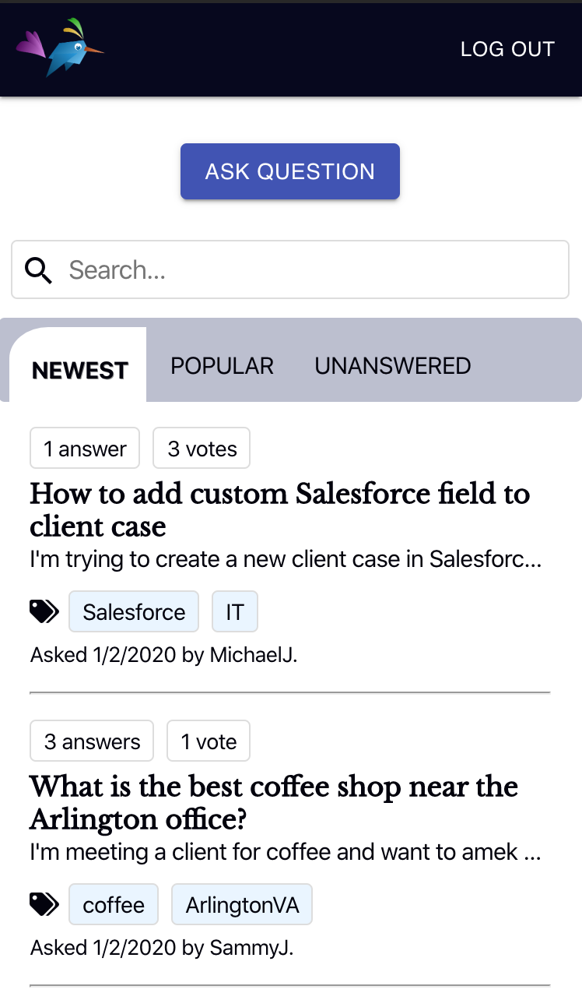
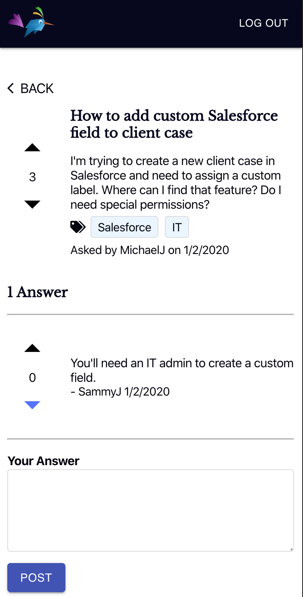

# Askify
Live app: https://askify.now.sh/

Server repo: https://github.com/lhendriks1/askify-api

## Summary
Askify is a Question Answer engine for users to post questions, answers and votes. The app has a JWT authentication system.

## Motivation
I use StackOverflow pretty regularly and am super grateful that it exists :D , so I was curious to see how it would be to implement a Q&A engine with a voting feature. I kind of liked the idea of building an app that I can deploy and is usable, but also I can continue to build out more complex features.

## Tech
Askify is a full-stack stack app built with React, Node, Express, and PostgreSQL. The app has a JWT authentication system and uses bcrypt to salt and hash passwords. 

### Test Driven Development (TDD)
- The server was built using test driven development (TDD) methodology with Mocha and Chai. 
- Unit tests on the React client are done with Jest and Enzyme.

### RESTful API
- The Askify server follows REST API design priciples. The app adheres to SOC best practices, one example being that the client and server are stored in separate repositories and use folder structure to organize components. To simplify server components and increase encapsulation the server utilizes Express Routing and service objects. The server is stateless (all state is held/maintained in the React client). The API has a uniform interface and adheres to HTTP response code definitions.

### Database
- PostgreSQL
- Postgrator migration tool
- Knex database query builder

### Deployment
- The React client is hosted on Zeit.
- The Node + Express server and PostgreSQL database are hosted on Heroku.

### Mobile First Approach
- The app is responsive to mobile, tablet and larger screen sizes. I built Askify using a mobile first approach

## Screenshots
- Mobile first design for the landing-page, users can demo the app without creating an account by using the 'demo' button to login as a test user.

 

- View of questions sorted by date. Users can filter and sort all questions.

 

- Users can vote on and answer questions.

